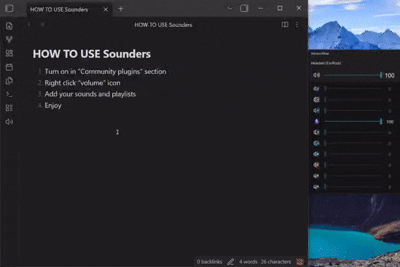
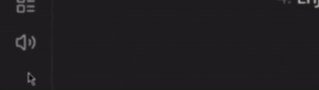

# Sounders

## Quick start

1. **Left-click** the **volume icon** in the sidebar to play the next track (default).
2. **Right-click** the sidebar icon to open the player and settings.
3. Add audio files individually or import an entire folder as a playlist.

## Features

- Sidebar button with configurable left-click action: play/pause or next track
- Shows what is currently playing

- Custom track order (drag and drop)
- Double-click a track name, artist, or playlist title to rename
- Shuffle and repeat modes (off / one / auto)
- Playback speed control (0.5x-2.0x), with double-click reset to 1.0x
- Seek bar for file tracks
- Search tracks in the active playlist
- Command Palette commands: Play next sound, Play/pause, Open settings(player)

## Settings

- Open via right-click the Sidebar icon, or **Settings → Community plugins → Sounders**.

- All tracks and playlists are automatically added to:

~~~bash
.obsidian\plugins\sounders\sounds
~~~

- Track order is stored at

~~~bash
.obsidian\plugins\sounders\data.json
~~~

---

See [CHANGELOG.md](https://github.com/Razzdol/obsidian-sounders/blob/main/CHANGELOG.md) for version history.

Found a bug? [Open an issue](https://github.com/Razzdol/obsidian-sounders/issues/new)

version 1.2.0

[by Razzdol :)](https://github.com/Razzdol)
